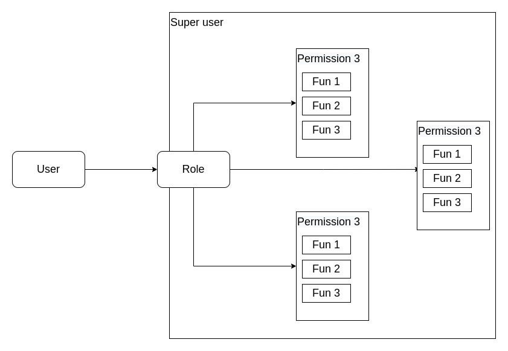

# Fatura Authentication and Authorization Task

This task is made for Fatura Egypt Company that requires secure authentication and authorization system for single user.

## Description

The application built with Laravel framework and it uses [Laravel Sanctum](https://laravel.com/docs/8.x/sanctum) for authenticating the users and uses [Laravel Permissions](https://spatie.be/docs/laravel-permission/v5/introduction) for authorizing the users for actions.

### Authentication

I had alot of options to make authentication system using diffrent packages and techniques but I choosed [Laravel Sanctum](https://laravel.com/docs/8.x/sanctum) as I start with fresh Laravel installation that is chipped with [Laravel Sanctum](https://laravel.com/docs/8.x/sanctum) already.

I had other options like [JWT](https://jwt-auth.readthedocs.io/en/develop/laravel-installation/), [Laravel Fortify](https://laravel.com/docs/8.x/fortify), [Laravel Jetstream](https://jetstream.laravel.com/2.x/introduction.html), [Laravel Passport](https://laravel.com/docs/8.x/passport) and [Laravel breeze](https://laravel.com/docs/8.x/starter-kits#laravel-breeze) as other options and I have the experience for using all of them but because of the requirments I choosed to use [Laravel Sanctum](https://laravel.com/docs/8.x/sanctum) as easy, simple and clean option.

### Authorization

For authorization demo I have built minimal CRUD for todo list and restricted every action to permission type but I have made role permission based system to group the permissions in one role and apply to the user although the package [Laravel Permissions](https://spatie.be/docs/laravel-permission/v5/introduction) has direct permissions, I don't perfer to use it as it's more clean to use role permission based system.

Also for authorization [Laravel Sanctum](https://laravel.com/docs/8.x/sanctum) has token abilities that can work like authorization system but I don't find it neat to use so I always recommend using [Laravel Permissions](https://spatie.be/docs/laravel-permission/v5/introduction) package for more clean and scalable authorization system.

The architecture of the authorization system is that User has role and every role has multiple permissions that allow him to do some functionalities, and we have "super" user who can do anything without the need of adding all permissions to him.



## Installation

-   After cloning the repository you need to run the next command **(make sure that you have [composer](https://getcomposer.org/download/) installed on your machine)**

```bash
composer install
```

-   copy `.env.example` file to `.env` file and then start to add your environment variables [required env variables to this project are database credentials] **(if you are going for production environment I don't recommend do that with `.env` file because of security issues that you can even google env files and expose senstive data so I recommend to do that with config files in config directory)**

```bash
cp .env.example .env
```

-   Generate application key

```bash
php artisan key:generate
```

-   Migrate your database and seed it with random data using

```bash
php artisan migrate --seed
```

-   You are ready to start your server at `localhost:8000`

```bash
php artisan serve
```

## License

The Laravel framework is open-sourced software licensed under the [MIT license](https://opensource.org/licenses/MIT).
